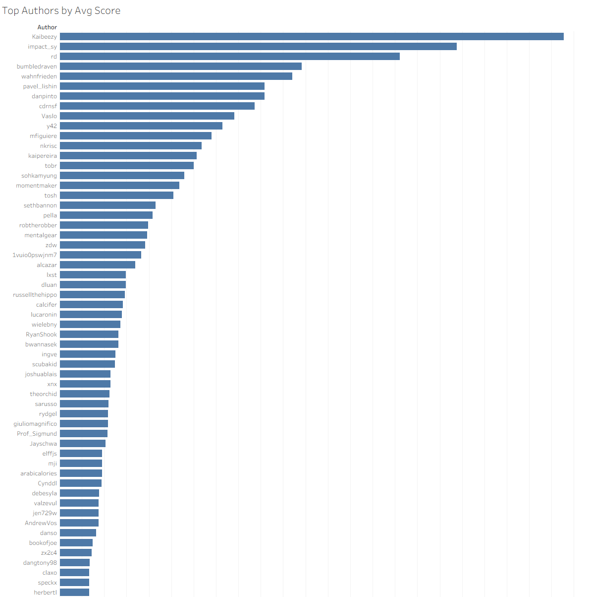
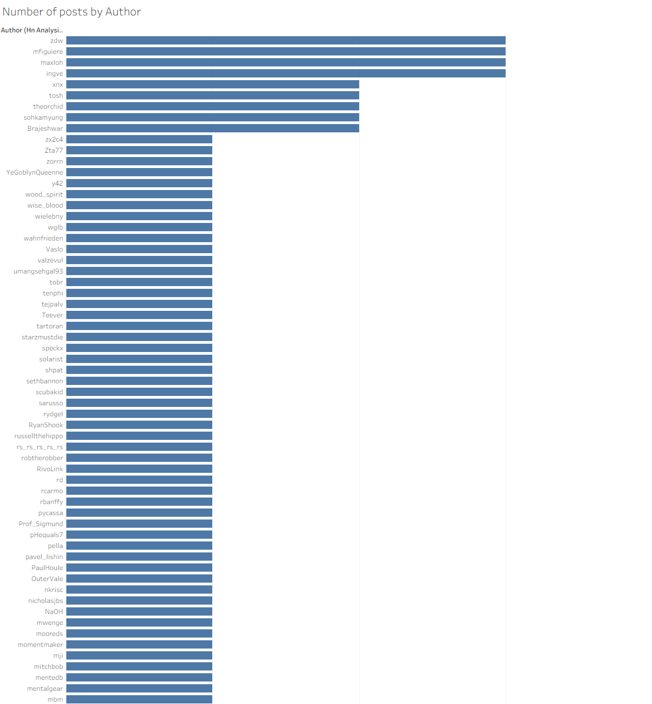
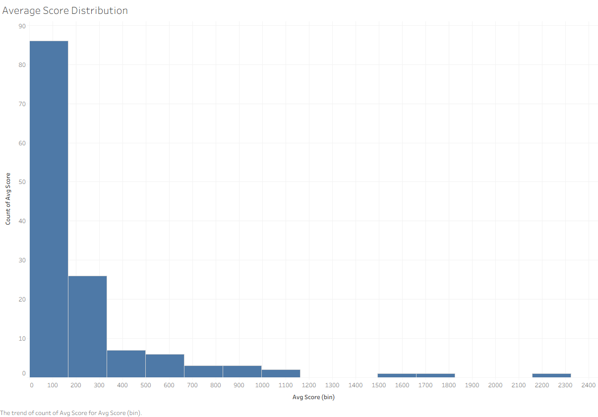

# Hacker News ETL Pipeline

A Python-based data pipeline that scrapes top stories from Hacker News, stores them in a PostgreSQL layer (RAW Json) and transforms them into the next layer (Cleaned SQL) for Tableau Visualization

## 🛠 Tech Stack
- **Orchestration:** Prefect 3.6
- **Scraping:** Scrapy
- **Database:** PostgreSQL
- **Language:** Python 3.14
- **Visualization:** Tableau

## 🏗 Architecture
1. **Scrape:** A Scrapy spider pulls the top stories from Hacker News.
2. **Load:** Data is cleaned and upserted into PostgreSQL (preventing duplicates).
3. **Transform:** A Materialized View (`hn_analysis`) aggregates data for optimal dashboard performance.
4. **Schedule:** Prefect manages a daily Cron job (8:00 AM) to refresh the data.

## 🚀 Setup Instructions

### 1. Environment Setup
```bash
python -m venv venv
source venv/Scripts/activate  # On Windows: venv\\Scripts\\activate
pip install -r requirements.txt
```

## Dashboard Preview


